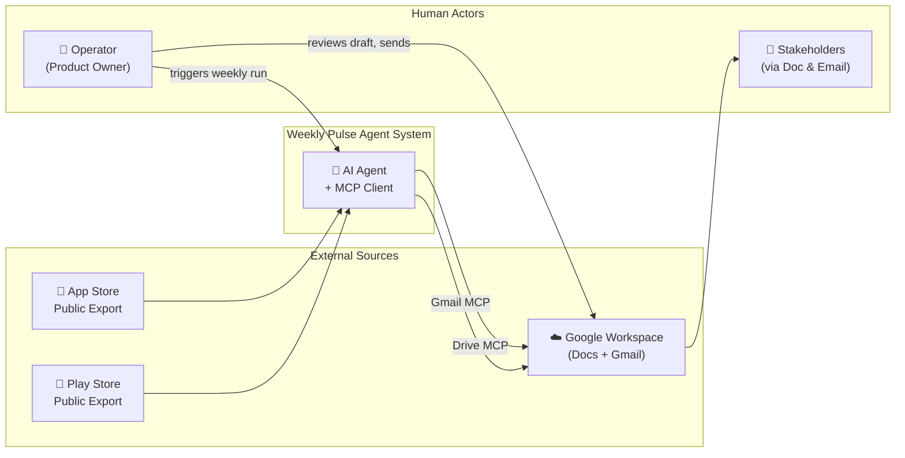
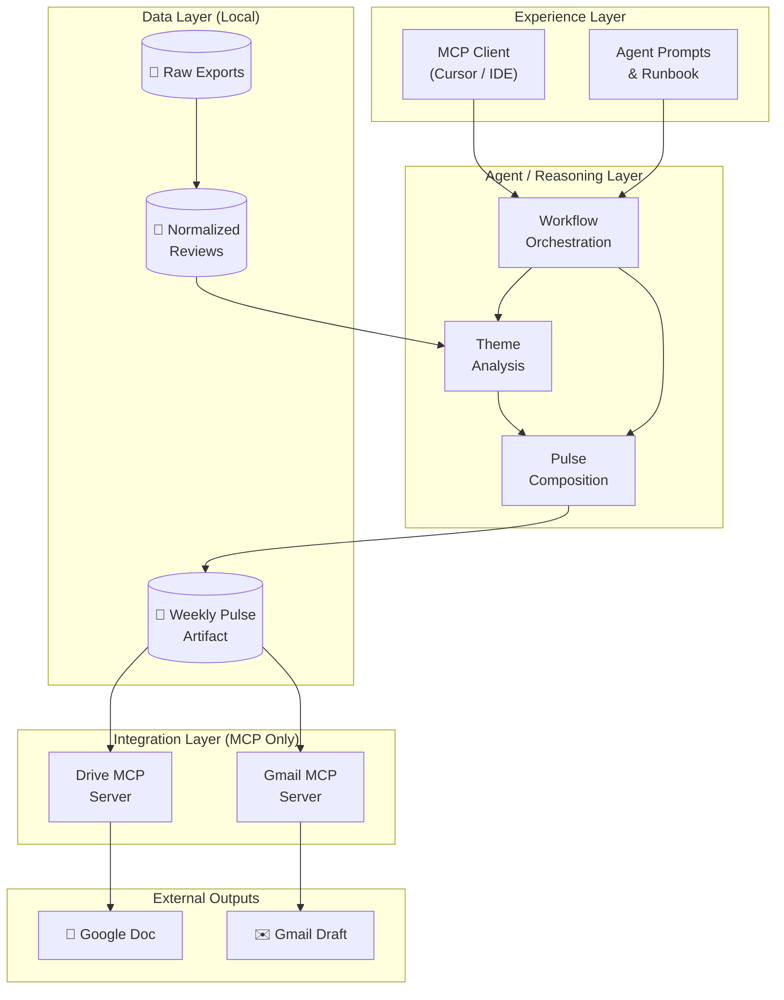
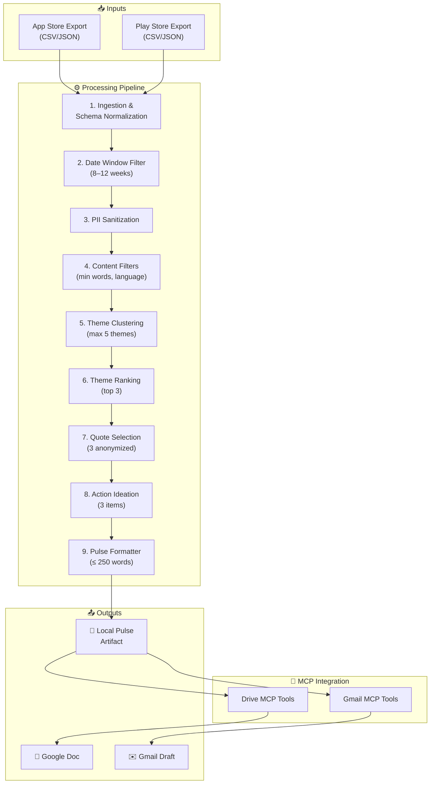
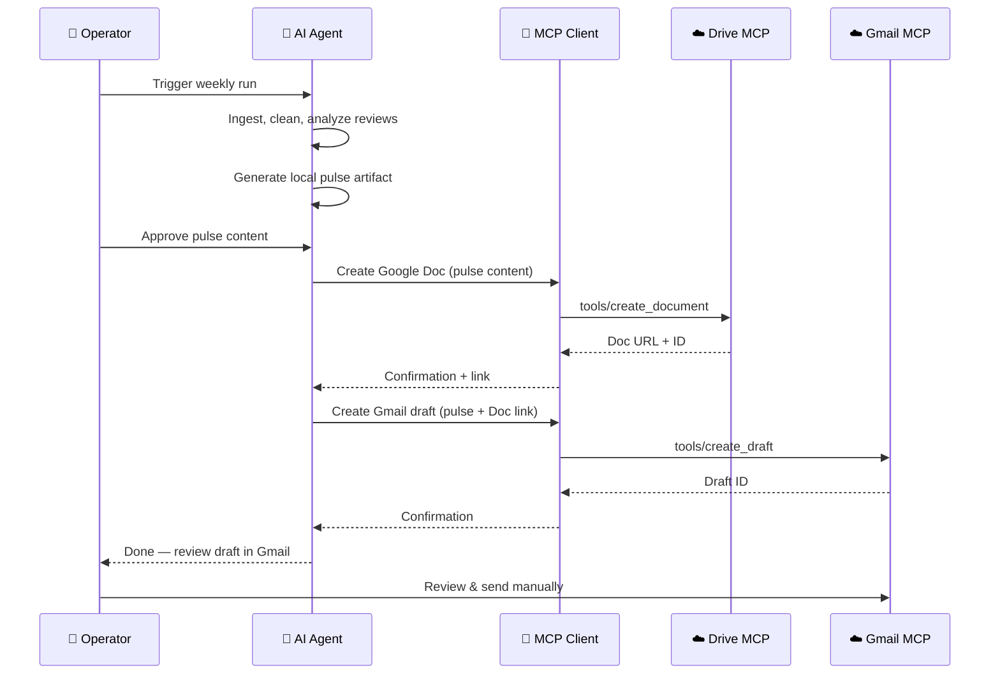
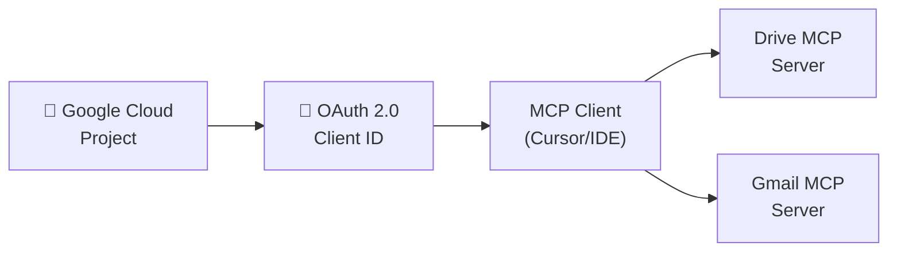
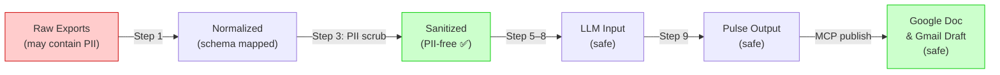
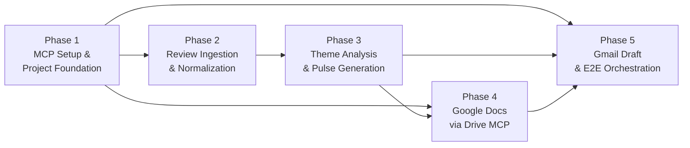

# 🏗️ Architecture — Weekly Review Pulse AI Agent (MCP)

> **Reference:** [problem statement.md](file:///c:/Users/Vaibhav%20Singh/Documents/milestone3%20ai%20agent/document/problem%20statement.md)

---

## 1. Purpose & Scope

This document describes the **system architecture** for Milestone 3: an AI agent that converts public mobile app reviews into a scannable weekly pulse, persists the note in **Google Docs**, and drafts a **Gmail** message — using **MCP (Model Context Protocol) servers** as the sole integration path to Google Workspace.

### In Scope

| Area | Detail |
| :--- | :--- |
| **Data ingestion** | App Store & Play Store public review exports (8–12 weeks) |
| **Analysis** | Theming (≤ 5 clusters), summarization, quote extraction |
| **Pulse generation** | One-page weekly note (≤ 250 words) with top 3 themes, 3 quotes, 3 actions |
| **Google Doc** | Created/updated via **Drive MCP** server |
| **Gmail draft** | Created via **Gmail MCP** server |
| **Privacy** | PII stripped before any output artifact |

### Out of Scope

- Direct Google REST / SDK API calls from application code
- Automated email send (draft only — human gate before send)
- Live store scraping or authenticated review APIs
- Custom web UI or scheduled cloud jobs (future scope)

---

## 2. System Context

The system sits between **static review exports** (inputs) and **Google Workspace** (outputs), with a human operator triggering weekly runs and reviewing drafts before send.



| Actor | Interaction |
| :--- | :--- |
| **Operator** | Drops new exports, runs agent, verifies pulse, sends Gmail draft |
| **AI Agent** | Reads data, reasons over reviews, calls MCP tools |
| **MCP Client** | Handles OAuth, tool discovery, transports tool calls to Google servers |
| **Stakeholders** | Read the Google Doc or forwarded email pulse |

---

## 3. Architectural Principles

| Principle | What It Means for This Project |
| :--- | :--- |
| **MCP as Google boundary** | All Gmail and Docs operations cross MCP only; no parallel API integration path |
| **Local-first analysis** | Review parsing, filtering, and pulse drafting happen against local data before any Google publish step |
| **Human gate before publish** | Operator can inspect local pulse artifact; Google steps run only after content is acceptable |
| **Deterministic data, probabilistic synthesis** | Ingestion/normalization are repeatable; theming and summarization are LLM-assisted with a fixed output shape |
| **Privacy by design** | PII stripped early in the pipeline; quotes selected only from sanitized text |
| **Fail visibly** | Auth errors, empty data, or MCP failures surface clearly — no silent partial outputs |

---

## 4. Logical Architecture (Layers)



### Layer Responsibilities

| Layer | Role |
| :--- | :--- |
| **Experience** | Where the operator works — MCP client, prompts, documentation, eval checklists. No business logic for Google APIs here beyond MCP configuration. |
| **Agent / Reasoning** | LLM-powered workflow: assign themes, rank issues, pick quotes, write actions, enforce word limit and structure. Orchestration decides *when* to move from analysis → local artifact → MCP publish. |
| **Data (Local)** | Canonical storage for exports, cleaned reviews, and the approved pulse markdown. Source of truth for content parity checks against Doc and email. |
| **Integration (MCP)** | Remote Google Workspace MCP servers. OAuth and tool contracts owned by MCP client + GCP project. |
| **External Outputs** | Durable deliverables stakeholders actually consume. |

---

## 5. Component Architecture (Processing Pipeline)



### Component Details

| # | Component | Input | Output | Notes |
| :---: | :--- | :--- | :--- | :--- |
| 1 | **Ingestion** | Raw CSV/JSON per store | Unified review records | Handles platform-specific column names and formats |
| 2 | **Date Window Filter** | All normalized reviews | Subset for analysis window | Configurable 8–12 weeks; logs count before/after |
| 3 | **PII Sanitization** | Review text + metadata | Redacted text | Strips emails, @handles, phone numbers, account IDs |
| 4 | **Content Filters** | Sanitized reviews | Quality-filtered set | Min word count (≥ 8 words), exclude reviews with emojis, English-only |
| 5 | **Theme Clustering** | Filtered reviews | ≤ 5 theme buckets + assignments | Product-aligned vocabulary (e.g., onboarding, KYC, payments) |
| 6 | **Theme Ranking** | Theme buckets | Ordered list; top 3 for pulse | Ranked by volume + negative sentiment weight |
| 7 | **Quote Selection** | Top themes + reviews | 3 short anonymized quotes | Rejected if PII detected; verbatim only |
| 8 | **Action Ideation** | Top themes | 3 concrete recommendations | Tied 1:1 to themes where possible |
| 9 | **Pulse Formatter** | Themes, quotes, actions | Scannable markdown ≤ 250 words | Fixed section structure for consistency |

---

## 6. Data Architecture

### 6.1 Directory Structure

```
milestone3 ai agent/
├── data/
│   ├── raw/                          # Untouched store exports
│   │   ├── appstore-reviews-YYYY-MM-DD.csv
│   │   └── playstore-reviews-YYYY-MM-DD.csv
│   └── processed/
│       ├── normalized-reviews.json   # Unified schema, all reviews
│       ├── reviews-for-llm.json      # Capped corpus (≤ 1,000 reviews)
│       └── normalization-summary.json
├── output/
│   └── weekly-pulse-YYYY-MM-DD.md    # Approved local artifact
├── prompts/                          # Agent system + occasion prompts
├── scripts/                          # Ingestion & normalization scripts
└── document/
    ├── problem statement.md
    └── architecture.md               # ← This file
```

### 6.2 Canonical Review Schema

Every review, regardless of source platform, is mapped to this unified schema:

```json
{
  "platform": "appstore | playstore",
  "date": "2026-05-15",
  "rating": 3,
  "title": "App keeps crashing after update",
  "text": "Since the last update the app crashes every time I try to open my statements...",
  "source": "appstore-reviews-2026-06-20.csv"
}
```

> [!NOTE]
> **No PII fields are retained.** Raw exports may contain usernames or device IDs — these are dropped during normalization (Step 1) and scrubbed during PII sanitization (Step 3).

### 6.3 LLM Corpus Cap

| Parameter | Value | Rationale |
| :--- | :--- | :--- |
| **Max reviews sent to LLM** | 1,000 | Stay within token budget and rate limits |
| **Selection strategy** | Recent-first, stratified by rating, prefer longer text | Over-represent low ratings (1–2★) for actionable signal |
| **Full archive** | Kept in `normalized-reviews.json` | Available for local stats, never sent to LLM |

---

## 7. LLM Integration Strategy

> [!IMPORTANT]
> The LLM is used strictly for **synthesis** (theming and pulse writing). All deterministic work — ingestion, normalization, filtering, PII scrubbing — runs as local Python scripts with **zero LLM calls**.

### 7.1 LLM Provider

| Item | Choice |
| :--- | :--- |
| **Provider** | [Groq](https://console.groq.com/) — fast inference API |
| **Model** | `llama-3.3-70b-versatile` |
| **Credential** | `GROQ_API_KEY` in `.env` (never committed) |
| **Where it runs** | Local Python script or IDE agent — **not** via MCP |

### 7.2 LLM Call Budget (Per Weekly Run)

| Call | Purpose | Approx. Input Tokens |
| :---: | :--- | :--- |
| **Call 1** | Theme clustering on stratified sample (~120 reviews) + stats | ~6,000–8,000 |
| **Call 2** | Pulse composition (top 3 themes, quotes, actions, ≤ 250 words) | ~4,000–6,000 |
| **Total** | **2 API calls per run** | ~12,000–15,000 |

> [!TIP]
> **Design rule:** Never send all reviews to the LLM. Local Python handles stats and ranking on the full corpus; the LLM sees a **small stratified sample (~120 reviews)** plus aggregated stats.

---

## 8. MCP Integration Architecture

### 8.1 MCP Server Endpoints

| Server | Endpoint | Purpose |
| :--- | :--- | :--- |
| **Drive MCP** | `https://drivemcp.googleapis.com/mcp/v1` | Create/update the weekly pulse as a Google Doc |
| **Gmail MCP** | `https://gmailmcp.googleapis.com/mcp/v1` | Create a draft email containing the pulse |

### 8.2 MCP Interaction Flow



### 8.3 MCP Tool Inventory (Expected)

| Server | Tool | Use |
| :--- | :--- | :--- |
| **Drive MCP** | `search_files` | Check if a pulse doc already exists for the week |
| **Drive MCP** | `create_file` | Create a new Google Doc with pulse content |
| **Drive MCP** | `update_file` | Update existing doc if re-running for the same week |
| **Gmail MCP** | `create_draft` | Create a draft email with the note body and Doc link |
| **Gmail MCP** | `list_drafts` | Verify draft was created successfully |

> [!WARNING]
> Tool names above are approximate. Run `tools/list` on each MCP server during setup (Phase 1) to capture the **actual** tool inventory. Adjust scripts accordingly.

### 8.4 Authentication & GCP Setup



| Step | Action |
| :--- | :--- |
| 1 | Create or select a GCP project |
| 2 | Enable **Drive API**, **Gmail API**, and their MCP counterparts |
| 3 | Configure OAuth consent screen (app name, required scopes) |
| 4 | Register OAuth client with redirect URIs supported by MCP client |
| 5 | Complete OAuth flow in MCP client for the operator account |
| 6 | Verify connectivity with read-only smoke tests on both servers |

---

## 9. Privacy & Data Handling

> [!CAUTION]
> Users' reviews may contain personal information. PII must be removed **before** any data leaves the local processing pipeline — meaning before LLM calls, before Google Doc publish, and before Gmail draft creation.

### 9.1 PII Sanitization Rules

| Pattern | Action | Example |
| :--- | :--- | :--- |
| Email addresses | Redact → `[REDACTED]` | `john@email.com` → `[REDACTED]` |
| @handles | Redact → `[REDACTED]` | `@username` → `[REDACTED]` |
| Phone numbers | Redact → `[REDACTED]` | `+91-98765-43210` → `[REDACTED]` |
| Account / Device IDs | Redact → `[REDACTED]` | `User ID: 12345` → `[REDACTED]` |

### 9.2 Data Flow Privacy Gates



---

## 10. Error Handling & Resilience

| Failure Mode | Detection | Response |
| :--- | :--- | :--- |
| **Empty/missing export files** | File check before ingestion | Abort with clear error message; do not produce empty pulse |
| **Too few reviews in window** | Count after date filter | Warn operator; widen window or skip week |
| **LLM rate limit exceeded** | API error response | Retry with exponential backoff; max 3 retries |
| **LLM returns malformed output** | JSON/structure validation | Re-prompt with stricter formatting instructions |
| **MCP OAuth expired** | 401/403 from MCP server | Prompt operator to re-authenticate; do not publish partial |
| **Drive MCP create fails** | MCP error response | Log error; retry once; surface to operator |
| **Gmail MCP draft fails** | MCP error response | Log error; note that Doc may exist without draft; retry |
| **PII detected in final pulse** | Post-generation PII scan | Block publish; flag for manual review |

---

## 11. Weekly Pulse Output Format

The final artifact follows a **fixed section structure** for consistency:

```markdown
# Weekly Review Pulse — [Date Range]

## 🔥 Top Themes This Week

### 1. [Theme Name]
[2–3 sentence summary of the theme]

### 2. [Theme Name]
[2–3 sentence summary of the theme]

### 3. [Theme Name]
[2–3 sentence summary of the theme]

## 💬 What Users Are Saying
> "[Anonymized quote 1]" — ★[rating]
> "[Anonymized quote 2]" — ★[rating]
> "[Anonymized quote 3]" — ★[rating]

## 🎯 Recommended Actions
1. [Action tied to Theme 1]
2. [Action tied to Theme 2]
3. [Action tied to Theme 3]

---
*Generated by Weekly Pulse Agent · [Total reviews analyzed] reviews · [Date]*
```

---

## 12. Implementation Phases



| Phase | Primary Outcome | Blocks |
| :---: | :--- | :--- |
| **1** | Google MCP connectivity proven (OAuth + smoke tests) | Phases 4, 5 |
| **2** | Clean, PII-free review dataset ready | Phase 3 |
| **3** | Approved local weekly pulse artifact | Phases 4, 5 |
| **4** | Live Google Doc created via Drive MCP | Phase 5 (full E2E) |
| **5** | Gmail draft created + full pipeline validated | **Milestone complete** |

> [!TIP]
> **Parallelism:** Phase 2 (data work) can start in parallel with Phase 1 (MCP setup) since ingestion has no MCP dependency. Phases 4 and 5 must wait until both Phase 1 (connectivity) and Phase 3 (content) are complete.

---

## 13. Technology Stack Summary

| Layer | Technology | Purpose |
| :--- | :--- | :--- |
| **Language** | Python 3.10+ | Scripts, data processing, LLM orchestration |
| **LLM Provider** | Groq (`llama-3.3-70b-versatile`) | Theme analysis & pulse composition |
| **MCP Client** | Cursor / IDE with MCP support | Tool discovery, OAuth, transport |
| **MCP Servers** | Google Drive MCP, Gmail MCP | Google Workspace integration |
| **Data Format** | JSON, CSV, Markdown | Review storage, pulse output |
| **Secrets** | `.env` file (gitignored) | `GROQ_API_KEY`, OAuth tokens |
| **Version Control** | Git | Repo management, export versioning |

---

*Architecture derived from [problem statement.md](file:///c:/Users/Vaibhav%20Singh/Documents/milestone3%20ai%20agent/document/problem%20statement.md)*
