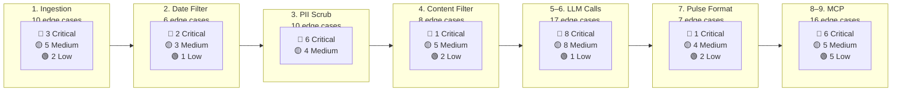

# ⚠️ Edge Cases — Weekly Review Pulse AI Agent (MCP)

> **Reference:** [architecture.md](file:///c:/Users/Vaibhav%20Singh/Documents/milestone3%20ai%20agent/document/architecture.md) · [implementation.md](file:///c:/Users/Vaibhav%20Singh/Documents/milestone3%20ai%20agent/document/implementation.md)

This document catalogs edge cases across every stage of the pipeline. Each entry includes the **scenario**, **risk level**, **expected behavior**, and **mitigation strategy**.

---

## How to Use This Document

- **During Development:** Validate each edge case as you build the corresponding pipeline component.
- **During Testing:** Use as a checklist — every row should have a tested resolution.
- **During Code Review:** Verify that the codebase handles each scenario gracefully.

**Risk Levels:**
- 🔴 **Critical** — Pipeline crashes, data leaks, or silent corruption
- 🟡 **Medium** — Degraded output quality or operator intervention required
- 🟢 **Low** — Cosmetic issues or rare occurrences with easy workarounds

---

---

## 1. Data Ingestion & File Handling

| # | Edge Case | Risk | Expected Behavior | Mitigation |
| :---: | :--- | :---: | :--- | :--- |
| 1.1 | **Export file is completely empty** (0 bytes) | 🔴 | Abort pipeline with clear error: "Export file is empty" | File size check before parsing; exit code ≠ 0 |
| 1.2 | **Export file is missing** (path does not exist) | 🔴 | Abort with error: "File not found: {path}" | `os.path.exists()` guard at pipeline entry |
| 1.3 | **Only one platform available** (e.g., Play Store only, no App Store export) | 🟡 | Proceed with single-platform data; log warning that analysis is partial | Allow partial ingestion; flag in `normalization-summary.json` |
| 1.4 | **CSV has wrong delimiter** (semicolons, tabs instead of commas) | 🔴 | Detect delimiter automatically or fail with descriptive error | Use `csv.Sniffer()` or pandas `sep=None` (auto-detect) |
| 1.5 | **CSV has BOM encoding** (UTF-8-BOM) | 🟡 | Parse correctly without leading `\ufeff` in first column name | Open file with `encoding='utf-8-sig'` |
| 1.6 | **Column names differ from expected** (store changed export format) | 🔴 | Fail loudly with: "Missing required column: {name}. Found: {actual}" | Column name validation with fuzzy matching fallback |
| 1.7 | **Duplicate reviews** in export (same review appearing twice) | 🟡 | Deduplicate by (platform, date, text) composite key | Dedup step after normalization; log count of duplicates removed |
| 1.8 | **Export contains non-UTF-8 characters** (Latin-1, Windows-1252) | 🟡 | Decode correctly or replace undecodable characters | Try `utf-8` first, fall back to `latin-1`; log encoding used |
| 1.9 | **Extremely large export file** (100K+ reviews) | 🟡 | Process without memory crash; cap LLM corpus to 1,000 | Use chunked reading (`pandas.read_csv(chunksize=...)`); stream processing |
| 1.10 | **Export has extra/unexpected columns** | 🟢 | Ignore extra columns; only map known canonical fields | Select only required columns; log ignored columns |

---

## 2. Date Window Filtering

| # | Edge Case | Risk | Expected Behavior | Mitigation |
| :---: | :--- | :---: | :--- | :--- |
| 2.1 | **All reviews are outside the 8–12 week window** | 🔴 | Abort with error: "0 reviews in window {start}–{end}. Export may be stale." | Count check after filter; abort if count == 0 |
| 2.2 | **Very few reviews in window** (< 20) | 🟡 | Warn: "Only {n} reviews in window. Pulse quality may be low." Proceed but flag. | Configurable minimum threshold; operator decision to widen window |
| 2.3 | **Date field is malformed or missing** | 🔴 | Skip review; log: "Skipped {n} reviews with invalid/missing dates" | `dateutil.parser.parse()` with `dayfirst=True` fallback; count skipped |
| 2.4 | **Reviews have future dates** (export error or timezone issue) | 🟡 | Exclude reviews with dates > today + 1 day; log count excluded | Date sanity check: `review_date <= today + timedelta(days=1)` |
| 2.5 | **Mixed date formats across platforms** (MM/DD/YYYY vs YYYY-MM-DD) | 🟡 | Normalize all dates to `YYYY-MM-DD` format during ingestion | Platform-specific date parsers in schema mapping |
| 2.6 | **Timezone differences** between App Store (UTC) and Play Store (local) | 🟢 | Normalize to UTC or strip time component (date-only comparison) | Use date-only comparison for window filtering |

---

## 3. PII Sanitization

| # | Edge Case | Risk | Expected Behavior | Mitigation |
| :---: | :--- | :---: | :--- | :--- |
| 3.1 | **Email embedded in review text** (e.g., "contact me at john@gmail.com") | 🔴 | Redact to: "contact me at [REDACTED]" | Regex: `[\w.-]+@[\w.-]+\.\w+` |
| 3.2 | **Phone number in various formats** (+91-98765, (212) 555-1234, 9876543210) | 🔴 | Redact all phone-like patterns | Multiple regex patterns for international, local, and spaced formats |
| 3.3 | **False positive: product version looks like phone** ("version 12345678") | 🟡 | Incorrectly redacted → pulse has `[REDACTED]` where version was | Contextual check: skip redaction if preceded by "version", "v", or "ver" |
| 3.4 | **Username in review text** ("my account vaibhav_123 was locked") | 🔴 | Redact account references | Regex for patterns: `account[\s:]*\w+`, `user[\s:]*\w+`, `id[\s:]*\d+` |
| 3.5 | **Aadhaar number** (12-digit Indian ID: "1234 5678 9012") | 🔴 | Redact any 12-digit number pattern (with spaces or hyphens) | Regex: `\d{4}[\s-]?\d{4}[\s-]?\d{4}` |
| 3.6 | **UPI ID in review** ("pay me at vaibhav@upi") | 🔴 | Caught by email regex since UPI IDs resemble email format | Email regex handles this; verify with test cases |
| 3.7 | **PII in review title** (not just body text) | 🔴 | Apply same sanitization to both `title` and `text` fields | Run PII scrub on all text fields, not just `text` |
| 3.8 | **Entire review is PII** (e.g., "Call me at 98765 43210 my email is x@y.com") | 🟡 | Review becomes mostly `[REDACTED]` — unusable for quoting | Drop reviews where > 50% of text is redacted; log count |
| 3.9 | **PII in non-English scripts** (Hindi name, Arabic phone format) | 🟡 | May not be caught by English-focused regex | Language filter (English-only) runs after PII scrub, removing non-English reviews |
| 3.10 | **LLM re-introduces PII** in generated pulse text | 🔴 | Post-generation PII scan catches it; block publish | Final PII gate after LLM output, before any MCP publish step |

---

## 4. Content Filtering

| # | Edge Case | Risk | Expected Behavior | Mitigation |
| :---: | :--- | :---: | :--- | :--- |
| 4.1 | **All reviews filtered out** (all < 7 words, or all non-English) | 🔴 | Abort: "0 reviews after content filters. Cannot generate pulse." | Count check after filtering; abort if 0 |
| 4.2 | **Review is entirely emoji** ("👍👍👍🔥🔥") | 🟡 | After emoji strip, text is empty → filtered by min-word rule | Emoji strip runs before word count check |
| 4.3 | **Mixed language review** ("Great app, bahut accha hai") | 🟡 | Language detection flags as non-English → filtered out | Accept if > 60% English words; strict mode: filter all mixed |
| 4.4 | **Review is only a star rating** (no title, no text) | 🟡 | Filtered by min-word rule (0 words < 7 threshold) | Already handled by empty text check in ingestion |
| 4.5 | **Review contains code snippets or URLs** | 🟢 | Keep the review but URLs may trigger PII regex | URL pattern: strip URLs but keep surrounding text |
| 4.6 | **Spammy/bot reviews** (repetitive text, keyword stuffing) | 🟡 | May create a misleading "spam" theme | Dedup identical text; optionally flag reviews with > 80% keyword overlap |
| 4.7 | **Extremely long review** (2,000+ words) | 🟢 | Accept but truncate for LLM input if needed | Cap individual review text at 500 chars for LLM corpus |
| 4.8 | **Review with only a title, no body text** | 🟡 | Combine title + text for word count; if title alone ≥ 7 words, keep | Concatenate fields before word count check |

---

## 5. Theme Clustering (LLM Call 1)

| # | Edge Case | Risk | Expected Behavior | Mitigation |
| :---: | :--- | :---: | :--- | :--- |
| 5.1 | **LLM returns more than 5 themes** | 🟡 | Trim to top 5 by review count; log warning | Validate JSON output: `len(themes) <= 5`; truncate if exceeded |
| 5.2 | **LLM returns fewer than 3 themes** (only 1 or 2 themes found) | 🟡 | Use all available themes; pulse will have < 3 theme sections | Allow 1–5 themes; adjust pulse template dynamically |
| 5.3 | **LLM returns duplicate/overlapping themes** ("App Crashes" and "App Freezing") | 🟡 | May inflate theme count with redundant categories | Add prompt instruction: "themes must be distinct and non-overlapping" |
| 5.4 | **LLM returns malformed JSON** (unterminated string, trailing comma) | 🔴 | Re-prompt with stricter JSON formatting instruction | JSON schema validation; auto-fix common issues (trailing commas); retry up to 3× |
| 5.5 | **LLM hallucinates a theme** not supported by reviews | 🟡 | Theme appears in pulse with no real evidence | Cross-check theme names against review keyword frequency; flag if no match |
| 5.6 | **LLM groups unrelated reviews into one theme** | 🟢 | Theme description is vague; quotes may not align | Prompt: "each theme must be supported by at least 5 reviews" |
| 5.7 | **Groq API returns 429 (rate limit)** | 🔴 | Retry with exponential backoff | Backoff: 2s → 4s → 8s; max 3 retries; abort if all fail |
| 5.8 | **Groq API returns 500 (server error)** | 🔴 | Retry once; if persistent, abort and surface error | Log full error; operator notification |
| 5.9 | **Groq API times out** (no response in 60s) | 🔴 | Retry once with shorter prompt; abort if second attempt also times out | Set timeout to 60s; truncate sample to ~80 reviews on retry |
| 5.10 | **LLM response exceeds token limit** (truncated output) | 🟡 | JSON may be cut off mid-structure | Set `max_tokens` generously (2,000+); validate completeness before parsing |

---

## 6. Quote Selection (LLM Call 2)

| # | Edge Case | Risk | Expected Behavior | Mitigation |
| :---: | :--- | :---: | :--- | :--- |
| 6.1 | **LLM invents a quote** not found in any review | 🔴 | Fabricated quote published as "user said" → credibility loss | Post-generation: fuzzy-match each quote against review corpus; reject if similarity < 70% |
| 6.2 | **Selected quote contains residual PII** | 🔴 | PII published in Google Doc / Gmail draft | Final PII scan on composed pulse; block publish if detected |
| 6.3 | **All candidate quotes are too short** (< 10 chars) | 🟡 | Quotes are unhelpful: `"bad"`, `"ok"`, `"nice"` | Prompt: "select quotes with at least 15 words that illustrate the theme" |
| 6.4 | **All candidate quotes are too long** (> 200 chars) | 🟢 | Quotes take too much of the 250-word budget | Prompt: "quotes should be 15–40 words each"; truncate with `...` if needed |
| 6.5 | **Fewer than 3 quotable reviews** available | 🟡 | Pulse has < 3 quotes; structure incomplete | Allow 1–3 quotes; note in pulse: "Limited review volume this week" |
| 6.6 | **Quote contains profanity or offensive language** | 🟡 | Published in stakeholder-facing Doc/email | Add content moderation check; censor or replace if flagged |
| 6.7 | **LLM modifies the quote** (paraphrases instead of verbatim) | 🔴 | Violates "verbatim only" constraint | Fuzzy-match against corpus; reject paraphrased quotes |

---

## 7. Pulse Formatting & Composition

| # | Edge Case | Risk | Expected Behavior | Mitigation |
| :---: | :--- | :---: | :--- | :--- |
| 7.1 | **Pulse exceeds 250 words** | 🟡 | Violates constraint; may be too long for quick scan | Post-generation word count check; re-prompt with stricter limit if exceeded |
| 7.2 | **Pulse has missing sections** (no quotes, or no actions) | 🔴 | Incomplete deliverable sent to stakeholders | Structural validation: check for all 3 required sections before saving |
| 7.3 | **Pulse contains markdown rendering issues** (broken links, unclosed formatting) | 🟢 | Doc may display incorrectly | Lint markdown output; fix common issues (unclosed `**`, `>` nesting) |
| 7.4 | **Action items are too vague** ("improve the app", "fix bugs") | 🟡 | Not actionable for product team | Prompt: "actions must be specific, measurable, and tied to a theme" |
| 7.5 | **Date range in header is wrong** (shows wrong week) | 🟢 | Confusing for stakeholders who reference by date | Compute date range programmatically from review dates, not LLM |
| 7.6 | **Pulse is a duplicate of last week** (same themes, same quotes) | 🟡 | Stakeholders see no new insight | Compare against previous week's pulse if available; flag overlap |
| 7.7 | **LLM returns pulse in wrong format** (HTML, plain text instead of markdown) | 🟡 | Google Doc rendering broken | Validate output starts with `# Weekly Review Pulse`; re-prompt if wrong format |

---

## 8. MCP Integration — Drive (Google Docs)

| # | Edge Case | Risk | Expected Behavior | Mitigation |
| :---: | :--- | :---: | :--- | :--- |
| 8.1 | **OAuth token expired** during Doc creation | 🔴 | 401 error; Doc not created | Detect 401; prompt operator to re-authenticate; do not retry with stale token |
| 8.2 | **Drive MCP server is down** or unreachable | 🔴 | Connection timeout; Doc not created | Retry once after 10s; if still down, save pulse locally and notify operator |
| 8.3 | **Duplicate Doc created** (re-run for same week) | 🟡 | Multiple docs with same title in Drive | Search for existing Doc by title before creating; update instead of duplicate |
| 8.4 | **Doc content is truncated** (MCP tool has size limit) | 🟡 | Partial pulse in Doc; stakeholders see incomplete content | Verify content length after creation; split into sections if tool has char limit |
| 8.5 | **MCP tool name changed** (API update) | 🔴 | Tool call fails with "unknown tool" | Use tool inventory from Phase 1; re-run `tools/list` if calls fail |
| 8.6 | **Markdown not rendered** in Google Doc (plain text) | 🟢 | Formatting lost; Doc is readable but ugly | Accept plain text as fallback; note limitation in README |
| 8.7 | **Insufficient Drive storage** (quota exceeded) | 🟢 | Doc creation fails with storage error | Catch specific error; notify operator to free space |
| 8.8 | **Doc created in wrong Drive folder** | 🟢 | Operator can't find the Doc | Specify parent folder ID in create call if supported; document default location |

---

## 9. MCP Integration — Gmail

| # | Edge Case | Risk | Expected Behavior | Mitigation |
| :---: | :--- | :---: | :--- | :--- |
| 9.1 | **OAuth token expired** during draft creation | 🔴 | 401 error; draft not created but Doc may already exist | Detect 401; prompt re-auth; note that Doc was created successfully |
| 9.2 | **Gmail MCP server is down** or unreachable | 🔴 | Draft not created | Retry once; log error; operator can manually create draft from local pulse |
| 9.3 | **Operator email is invalid** or not configured | 🔴 | Draft creation fails with invalid recipient | Validate `OPERATOR_EMAIL` in `.env` before pipeline starts |
| 9.4 | **Draft body exceeds Gmail size limit** | 🟢 | Draft creation fails or truncates | Pulse is ≤ 250 words (~1.5 KB) — well under Gmail's limits; unlikely but validate |
| 9.5 | **Google Doc link is missing** (Phase 4 failed) | 🟡 | Draft has no Doc link; body contains full pulse text only | Include full pulse in body as fallback; note "Doc link unavailable" |
| 9.6 | **Duplicate draft created** (re-run for same week) | 🟢 | Multiple drafts in inbox | Search drafts by subject before creating; or accept duplicates and let operator clean up |
| 9.7 | **Draft is accidentally sent** (operator clicks Send prematurely) | 🟡 | Unreviewed pulse reaches stakeholders | Human gate design: clearly label draft as "REVIEW BEFORE SENDING" in subject/body |
| 9.8 | **Gmail MCP scope insufficient** (compose only, no modify) | 🔴 | Draft creation fails with `insufficient_scope` | Verify scopes during Phase 1 setup; add `gmail.modify` scope |

---

## 10. LLM Provider (Groq) — Cross-Cutting

| # | Edge Case | Risk | Expected Behavior | Mitigation |
| :---: | :--- | :---: | :--- | :--- |
| 10.1 | **GROQ_API_KEY is missing or invalid** | 🔴 | Authentication error on first LLM call | Validate key format and test with a minimal ping before full pipeline |
| 10.2 | **Model `llama-3.3-70b-versatile` is deprecated** | 🔴 | API returns "model not found" | Externalize model name to `.env` or config; update without code changes |
| 10.3 | **Free tier daily token limit exceeded** (100K/day) | 🟡 | API returns 429 for the rest of the day | Budget enforcement: exactly 2 calls/run ≈ 15K tokens; abort if limit hit |
| 10.4 | **Input exceeds per-request token limit** (12K tokens/min) | 🔴 | API rejects request or queues with long wait | Cap input: ≤ 120 reviews, ≤ 500 chars/review; calculate token estimate before sending |
| 10.5 | **LLM returns empty response** | 🔴 | No themes or pulse generated | Retry once; if still empty, abort with "LLM returned empty response" |
| 10.6 | **LLM response contains instructions/system prompt leak** | 🟡 | Internal prompts visible in pulse output | Post-process: strip any text matching system prompt patterns |
| 10.7 | **Network interruption during LLM call** | 🔴 | Request hangs or fails | Timeout after 60s; retry once; abort on second failure |

---

## 11. Privacy & Compliance — Cross-Cutting

| # | Edge Case | Risk | Expected Behavior | Mitigation |
| :---: | :--- | :---: | :--- | :--- |
| 11.1 | **`.env` file accidentally committed** to git | 🔴 | API keys and OAuth secrets exposed | `.gitignore` includes `.env`; pre-commit hook to scan for secrets |
| 11.2 | **PII survives into the Google Doc** | 🔴 | Personal data published to stakeholders | Triple gate: PII scrub at ingestion → post-LLM scan → pre-publish scan |
| 11.3 | **Raw export files shared** via git (data/raw/ not ignored) | 🔴 | Original reviews with PII exposed | `.gitignore` includes `data/raw/*`; `.gitkeep` is the only tracked file |
| 11.4 | **LLM provider retains review data** for training | 🟡 | User content used for model improvement | Check Groq's data retention policy; use API opt-out if available |
| 11.5 | **Operator forwards Gmail draft** without reviewing | 🟡 | Unverified content reaches stakeholders | Draft subject includes "[REVIEW]" tag; body includes "Please review before sending" |
| 11.6 | **Google Doc is publicly accessible** (sharing settings) | 🟡 | Anyone with the link can see internal review analysis | Use "restricted" sharing by default; document in README |
| 11.7 | **Processed data remains on disk** after pipeline run | 🟢 | Old PII-free data accumulates | Optional: add cleanup script to archive/delete old `data/processed/` files |

---

## 12. Operational & Orchestration

| # | Edge Case | Risk | Expected Behavior | Mitigation |
| :---: | :--- | :---: | :--- | :--- |
| 12.1 | **Pipeline run interrupted mid-way** (crash, power loss) | 🟡 | Partial artifacts on disk; unclear pipeline state | Implement pipeline state tracking (e.g., `pipeline-status.json` with stage markers) |
| 12.2 | **Two concurrent pipeline runs** (operator triggers twice) | 🟡 | Duplicate artifacts, race conditions on files | Lock file (`pipeline.lock`) to prevent concurrent runs |
| 12.3 | **Pipeline runs on a week with no new reviews** | 🟡 | Generates a pulse from stale data | Compare export date against last run date; warn if no new data |
| 12.4 | **Disk space exhausted** during processing | 🔴 | Write failures; corrupted output files | Check available disk space before starting; warn if < 100 MB free |
| 12.5 | **Python version incompatible** (< 3.10) | 🔴 | Syntax errors or missing stdlib features | Check Python version at script entry: `sys.version_info >= (3, 10)` |
| 12.6 | **Dependencies not installed** (requirements.txt not run) | 🔴 | `ModuleNotFoundError` on import | Wrap imports in try/except with helpful message: "Run `pip install -r requirements.txt`" |
| 12.7 | **Network unavailable** (offline machine) | 🔴 | LLM and MCP calls fail | Check connectivity at pipeline start; abort with "No network connection detected" |

---

## Edge Case Summary by Pipeline Stage

### Totals

| Risk Level | Count | Action Required |
| :--- | :---: | :--- |
| 🔴 **Critical** | 27 | Must handle before MVP launch |
| 🟡 **Medium** | 34 | Should handle; may degrade quality if skipped |
| 🟢 **Low** | 13 | Nice to have; handle if time permits |
| **Total** | **74** | |

---

*Edge cases derived from [architecture.md](file:///c:/Users/Vaibhav%20Singh/Documents/milestone3%20ai%20agent/document/architecture.md) and [implementation.md](file:///c:/Users/Vaibhav%20Singh/Documents/milestone3%20ai%20agent/document/implementation.md)*
