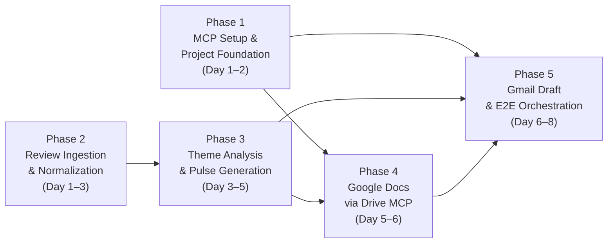
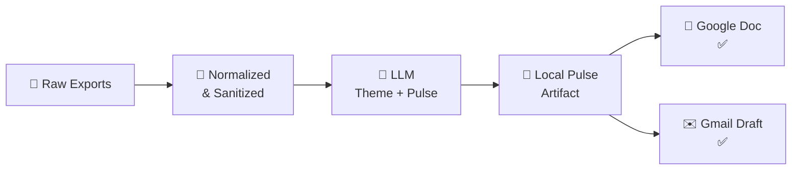
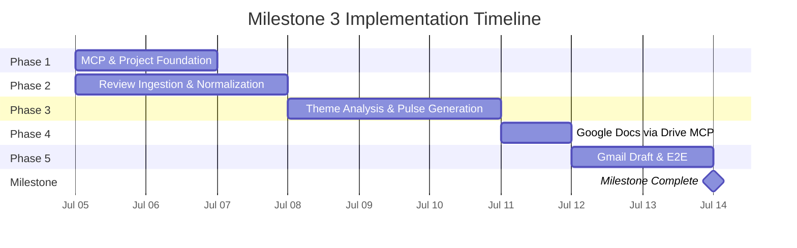

# 📋 Implementation Plan — Phase-Wise

> **Reference:** [architecture.md](file:///c:/Users/Vaibhav%20Singh/Documents/milestone3%20ai%20agent/document/architecture.md) · [problem statement.md](file:///c:/Users/Vaibhav%20Singh/Documents/milestone3%20ai%20agent/document/problem%20statement.md)

This plan breaks Milestone 3 into **five sequential phases**. Each phase ends with a gate: its evaluation checklist must pass before the next dependent phase starts.

---

## Phase Dependency Map



| Phase | Name | Primary Outcome | Blocks | Est. Duration |
| :---: | :--- | :--- | :--- | :---: |
| **1** | MCP & Project Foundation | Google MCP connectivity proven | Phases 4, 5 | 1–2 days |
| **2** | Review Ingestion & Normalization | Clean, PII-free review dataset | Phase 3 | 1–2 days |
| **3** | Theme Analysis & Pulse Generation | Approved local weekly pulse | Phases 4, 5 | 2–3 days |
| **4** | Google Docs via Drive MCP | Live Google Doc created | Phase 5 | 1 day |
| **5** | Gmail Draft & E2E Orchestration | Full pipeline validated | **Milestone done** | 1–2 days |

> [!TIP]
> **Parallelism:** Phase 2 (data work) can start in parallel with Phase 1 (MCP setup) since ingestion has no MCP dependency. This can shave 1–2 days off the total timeline.

**Estimated total duration:** 5–8 working days.

---

---

## Phase 1 — MCP & Project Foundation

### Objective

Establish the project skeleton, documentation, and **proven connectivity** to Google Drive MCP and Gmail MCP from the MCP client — before any review analysis or publish workflow is built.

### Why This Phase Comes First

All Google deliverables (Doc + draft) depend on OAuth and MCP tool access. Discovering auth or Workspace admin issues early avoids rework after analysis is complete.

### Prerequisites

- Milestone 1 product identified (which app's reviews will be used)
- Google account with access to Drive and Gmail
- Ability to create a Google Cloud project (or use an existing one)
- MCP-capable IDE/client installed (e.g. Cursor)

### In Scope

- Repository and folder conventions (`docs/`, `data/`, `prompts/`, `scripts/`)
- Google Cloud project setup for Workspace MCP
- OAuth client and MCP client configuration
- Tool discovery and read-only smoke tests on both MCP servers
- Secrets hygiene (`.env.example`, no credentials in git)

### Out of Scope

- Review parsing or pulse generation
- Creating production Docs or drafts with real pulse content
- Automated scheduling

---

### Detailed Activities

#### 1.1 Project Scaffolding

Create the directory structure defined in [architecture.md §6.1](file:///c:/Users/Vaibhav%20Singh/Documents/milestone3%20ai%20agent/document/architecture.md#L198-L217):

```
milestone3 ai agent/
├── data/
│   ├── raw/                          # Untouched store exports
│   └── processed/                    # Normalized + filtered outputs
├── output/                           # Weekly pulse artifacts
├── prompts/                          # Agent system + occasion prompts
├── scripts/                          # Python ingestion & normalization
├── document/
│   ├── problem statement.md
│   ├── architecture.md
│   └── implementation.md             # ← This file
├── .env.example                      # Required env var names (no values)
├── .gitignore                        # Exclude .env, data/raw/*, __pycache__
├── requirements.txt                  # Python dependencies
└── README.md                         # Project overview & setup guide
```

**Deliverables:**
- [ ] All directories created
- [ ] `.env.example` with placeholder keys (`GROQ_API_KEY=`, OAuth-related vars)
- [ ] `.gitignore` configured (`.env`, `data/raw/*`, `__pycache__/`, `.venv/`)
- [ ] `requirements.txt` with initial dependencies
- [ ] `README.md` with project overview and setup instructions

---

#### 1.2 Google Cloud Configuration

| Step | Action | Detail |
| :---: | :--- | :--- |
| 1 | Create or select GCP project | Name: `milestone3-weekly-pulse` (or similar) |
| 2 | Enable APIs | **Drive API**, **Gmail API**, and their MCP counterparts |
| 3 | OAuth consent screen | App name, required scopes as per MCP server docs |
| 4 | Register OAuth client | Redirect URIs matching MCP client requirements |
| 5 | Download credentials | Store `client_id` and `client_secret` securely |

**Deliverables:**
- [ ] GCP project created and APIs enabled
- [ ] OAuth consent screen configured
- [ ] OAuth client registered with correct redirect URIs
- [ ] Credentials noted in `.env` (never committed to git)

---

#### 1.3 MCP Client Setup

| Server | Endpoint | Config Action |
| :--- | :--- | :--- |
| **Drive MCP** | `https://drivemcp.googleapis.com/mcp/v1` | Register in MCP client settings |
| **Gmail MCP** | `https://gmailmcp.googleapis.com/mcp/v1` | Register in MCP client settings |

**Steps:**
1. Open MCP client (Cursor → Settings → Tools & MCP)
2. Add Drive MCP server endpoint
3. Add Gmail MCP server endpoint
4. Complete OAuth flow for the operator account
5. Capture available tools from `tools/list` for both servers

**Deliverables:**
- [ ] Both MCP server endpoints registered
- [ ] OAuth flow completed successfully
- [ ] Tool inventory documented (actual tool names and purposes)

---

#### 1.4 Connectivity Validation (Smoke Tests)

| Test ID | Server | Action | Expected Result |
| :---: | :--- | :--- | :--- |
| T1.1 | Drive MCP | List/search files (read-only) | Returns file list without error |
| T1.2 | Drive MCP | Create a test document | Document appears in Google Drive |
| T1.3 | Drive MCP | Delete test document | Clean up successful |
| T1.4 | Gmail MCP | List drafts or labels (read-only) | Returns data without error |
| T1.5 | Gmail MCP | Create a test draft | Draft appears in Gmail |
| T1.6 | Gmail MCP | Delete test draft | Clean up successful |

**Deliverables:**
- [ ] All smoke tests pass
- [ ] Any 403/auth issues documented with resolution steps
- [ ] MCP config location recorded in README

---

#### 1.5 Operational Baseline

- [ ] Record MCP config location (e.g. Cursor settings path) in README
- [ ] List required env variable *names* in `.env.example` (no values)
- [ ] Document any Workspace admin steps required for restricted scopes

---

### Phase 1 Exit Criteria

| # | Criterion | Status |
| :---: | :--- | :---: |
| 1 | Repo structure matches architecture §6.1 | ⬜ |
| 2 | `.env.example` and `.gitignore` in place | ⬜ |
| 3 | GCP project created, APIs enabled | ⬜ |
| 4 | OAuth client registered with correct redirect URIs | ⬜ |
| 5 | Drive MCP: read-only smoke test passes | ⬜ |
| 6 | Drive MCP: write smoke test passes | ⬜ |
| 7 | Gmail MCP: read-only smoke test passes | ⬜ |
| 8 | Gmail MCP: write smoke test passes | ⬜ |
| 9 | Tool inventory documented for both servers | ⬜ |
| 10 | No credentials in git history | ⬜ |

### Risks & Mitigations

| Risk | Mitigation |
| :--- | :--- |
| Gmail MCP 403 (Workspace admin restriction) | Follow Google MCP setup guide; request admin trust for OAuth app |
| Wrong OAuth redirect URI | Match MCP client documentation exactly |
| Tool list differs from docs | Record actual tools; adjust Phases 4–5 plans if names differ |

### Handoff

Phase 2 can start **in parallel** with Phase 1 (data ingestion has no MCP dependency), but **Phases 4–5 must not start** until Phase 1 exit criteria pass.

---

---

## Phase 2 — Review Ingestion & Normalization

### Objective

Turn raw App Store and Play Store **public exports** into a single, clean, PII-scrubbed dataset covering the configured **8–12 week** window — ready for theme analysis.

### Why This Phase Matters

Downstream theming and quotes are only as good as normalized input. PII must be removed here so LLM steps in Phase 3 never see identifiable data. **Phase 2 does not call any LLM** — it only prepares LLM-ready artifacts.

### Prerequisites

- Phase 1 repo structure in place (recommended, not blocking)
- Public review export files for the Milestone 1 product
- Documented export source URLs and download process

### In Scope

- Obtaining and versioning raw export files
- Platform-specific → unified schema mapping
- Date window filtering (8–12 weeks, default 10)
- PII detection and redaction on review text
- Content quality filters (min words, language, emoji strip)
- Volume and date-range reporting per platform
- LLM corpus cap selection (≤ 1,000 reviews)

### Out of Scope

- Theme clustering or pulse writing
- Google Doc or Gmail actions
- Scraping behind store logins

---

### Detailed Activities

#### 2.1 Source Acquisition

| Step | Action | Detail |
| :---: | :--- | :--- |
| 1 | Download latest public exports | iOS (App Store) and Android (Play Store) |
| 2 | Store under `data/raw/` | Naming: `appstore-reviews-YYYY-MM-DD.csv`, `playstore-reviews-YYYY-MM-DD.csv` |
| 3 | Record source metadata | Source URL, export date, product name |

**Script:** `scripts/fetch-reviews.py`

```python
# Pseudocode outline
def fetch_reviews(product_id, weeks=10):
    """Download public review exports for the given product."""
    # 1. Download from public export source
    # 2. Save to data/raw/ with timestamped filename
    # 3. Log: source URL, export date, review count
```

---

#### 2.2 Schema Normalization

Map each store's columns to the canonical schema from [architecture.md §6.2](file:///c:/Users/Vaibhav%20Singh/Documents/milestone3%20ai%20agent/document/architecture.md#L219-L232):

| Canonical Field | App Store Source | Play Store Source |
| :--- | :--- | :--- |
| `platform` | `"appstore"` (constant) | `"playstore"` (constant) |
| `date` | `Updated Date` | `Date` |
| `rating` | `Star Rating` | `Star Rating` |
| `title` | `Title` | `Review Title` |
| `text` | `Review` | `Review Text` |
| `source` | filename | filename |

**Handling edge cases:**
- Missing titles → set to empty string
- Multi-line text → collapse to single line
- Date format differences → normalize to `YYYY-MM-DD`
- Empty review text → drop row and log count

**Script:** `scripts/normalize-reviews.py`
**Output:** `data/processed/normalized-reviews.json`

---

#### 2.3 Date Window Filtering

| Parameter | Default | Configurable |
| :--- | :--- | :--- |
| Window size | 10 weeks | Yes (8–12 weeks via CLI arg) |
| Reference date | Today's date | Yes (for reproducible runs) |

**Steps:**
1. Compute cutoff date from reference date
2. Filter normalized set to window
3. Log count before/after filtering
4. Confirm min/max review dates in output meet expectations

---

#### 2.4 PII Sanitization

Apply redaction rules from [architecture.md §9.1](file:///c:/Users/Vaibhav%20Singh/Documents/milestone3%20ai%20agent/document/architecture.md#L351-L358):

| Pattern | Regex | Replacement |
| :--- | :--- | :--- |
| Email addresses | `[\w.-]+@[\w.-]+\.\w+` | `[REDACTED]` |
| @handles | `@\w+` | `[REDACTED]` |
| Phone numbers | `[\+]?[\d\s\-\(\)]{7,15}` | `[REDACTED]` |
| Account/Device IDs | `(?:user\|account\|device)[\s]*(?:id)?[\s:]*\d+` | `[REDACTED]` |

**Script:** `scripts/sanitize-pii.py` (or integrated into `normalize-reviews.py`)

> [!CAUTION]
> PII sanitization runs **before** any data leaves the local pipeline — meaning before LLM calls, before Google Doc publish, and before Gmail draft creation.

---

#### 2.5 Content Quality Filters

| Filter | Rule | Rationale |
| :--- | :--- | :--- |
| Minimum word count | Drop reviews with **≤ 6 words** in title + text (keep ≥ 7) | Too short for meaningful theming |
| Emoji stripping | Strip all emoji characters from title and text | Cleaner text for LLM processing |
| Language filter | Keep **English only**; remove Hindi and other languages | Consistent LLM analysis language |

---

#### 2.6 LLM Corpus Cap

From [architecture.md §6.3](file:///c:/Users/Vaibhav%20Singh/Documents/milestone3%20ai%20agent/document/architecture.md#L237-L243):

| Parameter | Value |
| :--- | :--- |
| Max reviews for LLM | ≤ 1,000 |
| Selection strategy | Recent-first, stratified by rating, prefer longer text |
| Over-representation | 1–2★ reviews (higher signal for actionable themes) |

**Output files:**
- `data/processed/reviews-for-llm.json` — Capped corpus (≤ 1,000)
- `data/processed/normalization-summary.json` — Stats including `llm_corpus_cap`, `llm_corpus_count`

---

#### 2.7 Quality Reporting

Generate a `normalization-summary.json` with:

```json
{
  "run_date": "2026-07-05",
  "window_weeks": 10,
  "total_raw_reviews": 2500,
  "after_date_filter": 1800,
  "after_pii_sanitization": 1800,
  "after_content_filters": 1708,
  "llm_corpus_cap": 1000,
  "llm_corpus_count": 1000,
  "per_platform": {
    "appstore": 820,
    "playstore": 888
  },
  "star_distribution": {
    "1": 245, "2": 189, "3": 312, "4": 410, "5": 552
  }
}
```

---

### Phase 2 Exit Criteria

| # | Criterion | Status |
| :---: | :--- | :---: |
| 1 | Raw exports stored in `data/raw/` with platform + date naming | ⬜ |
| 2 | `normalized-reviews.json` exists with canonical schema | ⬜ |
| 3 | Date window filter applied; count logged before/after | ⬜ |
| 4 | PII sanitization applied; no emails, handles, phones, or IDs in output | ⬜ |
| 5 | Content filters applied (min words, language, emoji strip) | ⬜ |
| 6 | `reviews-for-llm.json` exists with ≤ 1,000 reviews | ⬜ |
| 7 | `normalization-summary.json` with complete stats | ⬜ |
| 8 | No PII in any processed artifact (spot-check verified) | ⬜ |
| 9 | Source URLs and export dates documented | ⬜ |

### Risks & Mitigations

| Risk | Mitigation |
| :--- | :--- |
| Too few reviews in window | Widen window to 12 weeks; document threshold for skipping a week |
| Platform export format changes | Build flexible column mapping; fail loudly on missing required columns |
| PII regex misses edge cases | Run manual spot-check on 20 random reviews; iterate regex patterns |

### Handoff

Phase 3 requires the cleaned `reviews-for-llm.json` and `normalization-summary.json` from Phase 2.

---

---

## Phase 3 — Theme Analysis & Pulse Generation

### Objective

Use the **LLM** (Groq) to analyze the cleaned review corpus, cluster reviews into themes, and produce a **local weekly pulse artifact** — the approved markdown that will be published in Phases 4 and 5.

### Why This Phase Matters

This is the **intelligence core** of the agent — where raw data becomes actionable insight. The quality of themes, quotes, and actions directly determines stakeholder value.

### Prerequisites

- Phase 2 complete: `reviews-for-llm.json` and `normalization-summary.json` available
- Groq API key configured in `.env`

### In Scope

- LLM-powered theme clustering (≤ 5 themes)
- Theme ranking (top 3 by volume + sentiment)
- Quote selection (3 anonymized, verbatim)
- Action ideation (3 concrete recommendations)
- Pulse formatting (≤ 250 words, fixed structure)
- Local artifact persistence

### Out of Scope

- Google Doc or Gmail publishing (Phases 4–5)
- Direct Google API calls

---

### Detailed Activities

#### 3.1 Local Statistics (Pre-LLM, No API Calls)

Before calling the LLM, compute local statistics on the **full** corpus to give the LLM aggregated context:

```python
# Pseudocode
stats = {
    "total_reviews": len(reviews),
    "star_distribution": count_by_rating(reviews),
    "avg_rating": mean(r["rating"] for r in reviews),
    "date_range": f"{min_date} to {max_date}",
    "top_keywords": extract_keywords(reviews, top_n=20),  # TF-IDF or frequency
    "negative_review_pct": count_low_rating(reviews) / len(reviews)
}
```

---

#### 3.2 Stratified Sample for LLM

From [architecture.md §7.2](file:///c:/Users/Vaibhav%20Singh/Documents/milestone3%20ai%20agent/document/architecture.md#L261-L270):

| Parameter | Value |
| :--- | :--- |
| Sample size | ~120 reviews |
| Strategy | Stratified by rating; over-represent 1–2★ |
| Selection | Recent-first within each stratum; prefer longer text |

> [!IMPORTANT]
> **Design rule:** Never send all 1,000 reviews to the LLM. Local Python handles stats and ranking on the full corpus; the LLM sees a **small stratified sample (~120 reviews)** plus aggregated stats.

---

#### 3.3 LLM Call 1 — Theme Clustering

| Property | Value |
| :--- | :--- |
| **Provider** | Groq |
| **Model** | `llama-3.3-70b-versatile` |
| **Input** | ~120 review samples + aggregated stats |
| **Approx. tokens** | ~6,000–8,000 |
| **Output** | JSON with ≤ 5 themes, each with name, description, review count, sentiment |

**Prompt structure:**

```
You are a product analyst. Given the following app reviews and statistics,
identify up to 5 recurring themes.

For each theme, provide:
- theme_name: short label (e.g., "App Crashes", "Slow KYC")
- description: 2–3 sentence summary
- review_count: approximate number of reviews in this theme
- sentiment: "positive" | "negative" | "mixed"
- sample_quotes: 2–3 verbatim, anonymized quotes from the reviews

Statistics:
{stats_json}

Reviews:
{sample_reviews_json}

Respond in valid JSON only.
```

**Output:** `data/processed/themes.json`

---

#### 3.4 LLM Call 2 — Pulse Composition

| Property | Value |
| :--- | :--- |
| **Input** | Theme clustering output + stats |
| **Approx. tokens** | ~4,000–6,000 |
| **Output** | Formatted markdown pulse (≤ 250 words) |

**Prompt structure:**

```
You are writing a weekly review pulse for a product team.
Using the themes and quotes below, write a scannable one-page note.

Structure (MUST follow exactly):
1. Top 3 Themes — 2–3 sentence summary each
2. What Users Are Saying — 3 anonymized verbatim quotes with star ratings
3. Recommended Actions — 3 concrete next steps, tied to themes

Constraints:
- Maximum 250 words total
- No PII — no names, emails, device IDs
- Quotes must be verbatim from the provided data (do not invent)

Themes:
{themes_json}

Write the pulse in markdown format.
```

**Output:** `output/weekly-pulse-YYYY-MM-DD.md`

---

#### 3.5 Post-Generation Validation

| Check | Rule | Action on Failure |
| :--- | :--- | :--- |
| Word count | ≤ 250 words | Re-prompt with stricter constraint |
| Section count | Exactly 3 sections (Themes, Quotes, Actions) | Re-prompt with structure enforcement |
| Quote count | Exactly 3 quotes | Re-prompt |
| Action count | Exactly 3 actions | Re-prompt |
| PII scan | No emails, handles, phones, IDs detected | Block and flag for manual review |
| Theme count | ≤ 5 (clustering), top 3 in pulse | Validate JSON structure |

---

#### 3.6 Local Artifact Persistence

Save the approved pulse to:
```
output/weekly-pulse-YYYY-MM-DD.md
```

Following the fixed format from [architecture.md §11](file:///c:/Users/Vaibhav%20Singh/Documents/milestone3%20ai%20agent/document/architecture.md#L399-L429):

```markdown
# Weekly Review Pulse — [Date Range]

## 🔥 Top Themes This Week

### 1. [Theme Name]
[2–3 sentence summary]

### 2. [Theme Name]
[2–3 sentence summary]

### 3. [Theme Name]
[2–3 sentence summary]

## 💬 What Users Are Saying
> "[Anonymized quote 1]" — ★[rating]
> "[Anonymized quote 2]" — ★[rating]
> "[Anonymized quote 3]" — ★[rating]

## 🎯 Recommended Actions
1. [Action tied to Theme 1]
2. [Action tied to Theme 2]
3. [Action tied to Theme 3]

---
*Generated by Weekly Pulse Agent · [N] reviews · [Date]*
```

---

### Phase 3 Exit Criteria

| # | Criterion | Status |
| :---: | :--- | :---: |
| 1 | Stratified sample of ~120 reviews prepared | ⬜ |
| 2 | LLM Call 1 returns valid `themes.json` with ≤ 5 themes | ⬜ |
| 3 | LLM Call 2 returns formatted pulse markdown | ⬜ |
| 4 | Pulse is ≤ 250 words | ⬜ |
| 5 | Pulse contains exactly 3 themes, 3 quotes, 3 actions | ⬜ |
| 6 | No PII in pulse (post-generation scan passes) | ⬜ |
| 7 | Quotes are verbatim from reviews (not invented) | ⬜ |
| 8 | `weekly-pulse-YYYY-MM-DD.md` saved in `output/` | ⬜ |
| 9 | Total Groq API calls = exactly 2 | ⬜ |
| 10 | Operator approves pulse content | ⬜ |

### Risks & Mitigations

| Risk | Mitigation |
| :--- | :--- |
| LLM rate limit exceeded | Retry with exponential backoff; max 3 retries |
| LLM returns malformed JSON | Re-prompt with stricter formatting; validate schema |
| LLM invents quotes | Cross-check quotes against review corpus; reject non-matches |
| Pulse exceeds 250 words | Re-prompt with explicit word count enforcement |
| Themes too generic | Provide product-specific vocabulary in system prompt |

### Handoff

Phases 4 and 5 require the approved `output/weekly-pulse-YYYY-MM-DD.md` from Phase 3.

---

---

## Phase 4 — Google Docs via Drive MCP

### Objective

Publish the approved weekly pulse as a **Google Doc** using the Drive MCP server — no direct Google API calls.

### Why This Phase Matters

The Google Doc is the **primary deliverable** for stakeholders. It must be created reliably, contain the exact same content as the local artifact, and be shareable via link.

### Prerequisites

- Phase 1 complete: Drive MCP connectivity proven
- Phase 3 complete: Approved `weekly-pulse-YYYY-MM-DD.md` available

### In Scope

- Creating a new Google Doc with pulse content via Drive MCP
- Checking for existing pulse docs (same week) to avoid duplicates
- Capturing the Doc URL for inclusion in Gmail draft (Phase 5)

### Out of Scope

- Gmail draft creation (Phase 5)
- Formatting beyond what Drive MCP supports
- Sharing permissions management (use default)

---

### Detailed Activities

#### 4.1 Check for Existing Pulse Doc

Before creating a new document, search for an existing pulse doc for the current week:

```
MCP Tool: search_files (or equivalent from Phase 1 tool inventory)
Query: "Weekly Review Pulse — [Date Range]"
```

| Result | Action |
| :--- | :--- |
| No existing doc | Proceed to create new doc (4.2) |
| Existing doc found | Update content (4.3) instead of creating duplicate |

---

#### 4.2 Create New Google Doc

```
MCP Tool: create_file (or equivalent)
Input:
  - title: "Weekly Review Pulse — [Date Range]"
  - content: [pulse markdown content]
  - mimeType: "application/vnd.google-apps.document"
Output:
  - document_id
  - document_url
```

**Capture:** Store `document_url` for use in Phase 5 (Gmail draft body).

---

#### 4.3 Update Existing Google Doc (Re-run Scenario)

```
MCP Tool: update_file (or equivalent)
Input:
  - file_id: [existing document_id]
  - content: [updated pulse markdown content]
Output:
  - confirmation
```

---

#### 4.4 Content Parity Verification

After creating/updating the Doc, verify that the content matches the local artifact:

| Check | Method |
| :--- | :--- |
| Doc exists | Verify `document_url` is accessible |
| Title matches | Compare Doc title with expected format |
| Content complete | Spot-check that themes, quotes, and actions are present |

---

### Phase 4 Exit Criteria

| # | Criterion | Status |
| :---: | :--- | :---: |
| 1 | Google Doc created via Drive MCP (not direct API) | ⬜ |
| 2 | Doc title follows format: "Weekly Review Pulse — [Date Range]" | ⬜ |
| 3 | Doc content matches local `weekly-pulse-YYYY-MM-DD.md` | ⬜ |
| 4 | `document_url` captured for Phase 5 | ⬜ |
| 5 | No duplicate docs for same week (search check works) | ⬜ |
| 6 | Doc is accessible via shareable link | ⬜ |

### Risks & Mitigations

| Risk | Mitigation |
| :--- | :--- |
| MCP OAuth expired | Prompt re-authentication; do not publish partial content |
| Drive MCP create fails | Log error; retry once; surface to operator |
| Markdown rendering in Doc | Accept plain text if rich formatting unsupported by MCP tool |
| Tool names differ from expected | Use actual tool inventory from Phase 1 |

### Handoff

Phase 5 requires the `document_url` from Phase 4 to include in the Gmail draft.

---

---

## Phase 5 — Gmail Draft & E2E Orchestration

### Objective

Create a **Gmail draft** containing the weekly pulse and a link to the Google Doc, then validate the **full end-to-end pipeline** from raw exports to published deliverables.

### Why This Phase Matters

This is the **final mile** — the draft email is what the operator sends to stakeholders. It also serves as the E2E validation that every component works together.

### Prerequisites

- Phase 1 complete: Gmail MCP connectivity proven
- Phase 3 complete: Approved pulse artifact available
- Phase 4 complete: Google Doc URL available

### In Scope

- Creating a Gmail draft via Gmail MCP
- Including pulse content and Doc link in draft body
- Full end-to-end pipeline validation
- Error handling for MCP failures

### Out of Scope

- Automated email send (human gate — operator reviews and sends manually)
- Email recipient management beyond self/alias
- Email templates or HTML formatting (plain text/markdown acceptable)

---

### Detailed Activities

#### 5.1 Create Gmail Draft

```
MCP Tool: create_draft (or equivalent from Phase 1 tool inventory)
Input:
  - to: [operator email or alias]
  - subject: "Weekly Review Pulse — [Date Range]"
  - body: |
      Hi team,

      Here is this week's review pulse for [Product Name].

      [Full pulse content — themes, quotes, actions]

      📄 Full document: [Google Doc URL from Phase 4]

      ---
      Generated by Weekly Pulse Agent · [N] reviews analyzed
Output:
  - draft_id
```

---

#### 5.2 Verify Draft Created

```
MCP Tool: list_drafts (or equivalent)
Verify: draft_id exists in the list
```

---

#### 5.3 End-to-End Pipeline Validation

Run the **complete pipeline** from start to finish and verify every artifact:



| Checkpoint | Verification | Status |
| :---: | :--- | :---: |
| 1 | Raw exports exist in `data/raw/` | ⬜ |
| 2 | `normalized-reviews.json` has correct schema and count | ⬜ |
| 3 | `reviews-for-llm.json` has ≤ 1,000 reviews | ⬜ |
| 4 | No PII in any processed artifact | ⬜ |
| 5 | `themes.json` has ≤ 5 valid themes | ⬜ |
| 6 | `weekly-pulse-YYYY-MM-DD.md` is ≤ 250 words with correct structure | ⬜ |
| 7 | Google Doc exists with matching content | ⬜ |
| 8 | Gmail draft exists with pulse + Doc link | ⬜ |
| 9 | Total Groq API calls = 2 | ⬜ |
| 10 | Total MCP calls = minimum needed (no redundant calls) | ⬜ |

---

#### 5.4 Operator Handoff

After E2E validation passes:

1. **Notify operator** that pulse is ready
2. Operator reviews Gmail draft
3. Operator manually clicks **Send** (human gate — no automated send)
4. Stakeholders receive the pulse email and access the Google Doc

---

### Phase 5 Exit Criteria

| # | Criterion | Status |
| :---: | :--- | :---: |
| 1 | Gmail draft created via Gmail MCP (not direct API) | ⬜ |
| 2 | Draft contains full pulse content | ⬜ |
| 3 | Draft contains link to Google Doc from Phase 4 | ⬜ |
| 4 | Draft recipient is operator email or alias | ⬜ |
| 5 | Full E2E pipeline validated (all 10 checkpoints pass) | ⬜ |
| 6 | No PII in draft content | ⬜ |
| 7 | Operator can review and send draft manually | ⬜ |

### Risks & Mitigations

| Risk | Mitigation |
| :--- | :--- |
| Gmail MCP OAuth expired | Prompt re-authentication before draft creation |
| Gmail MCP draft fails | Log error; note Doc may exist without draft; retry once |
| Doc link not available | Fall back to including full pulse content in draft body only |
| Draft content truncated | Verify full content present; split into body + attachment if needed |

---

---

## Milestone Acceptance Criteria

> [!IMPORTANT]
> The milestone is complete **only** when all five phase exit criteria pass and the items below are verified.

| # | Criterion | Phase | Status |
| :---: | :--- | :---: | :---: |
| 1 | MCP connectivity proven (Drive + Gmail) | 1 | ⬜ |
| 2 | Clean, PII-free review dataset ready | 2 | ⬜ |
| 3 | Local pulse artifact approved (≤ 250 words, correct structure) | 3 | ⬜ |
| 4 | Google Doc published via Drive MCP | 4 | ⬜ |
| 5 | Gmail draft created via Gmail MCP with Doc link | 5 | ⬜ |
| 6 | No direct Google API calls — MCP-only integration | All | ⬜ |
| 7 | No PII in any deliverable | All | ⬜ |
| 8 | No credentials committed to git | All | ⬜ |
| 9 | Full E2E pipeline runs successfully | 5 | ⬜ |
| 10 | All documentation complete (problem statement, architecture, implementation) | All | ⬜ |

---

## Suggested Timeline



> [!NOTE]
> Phases 1 and 2 run in parallel (Day 1–3). Total estimated duration: **5–8 working days**.

---

*Implementation plan derived from [architecture.md](file:///c:/Users/Vaibhav%20Singh/Documents/milestone3%20ai%20agent/document/architecture.md)*
